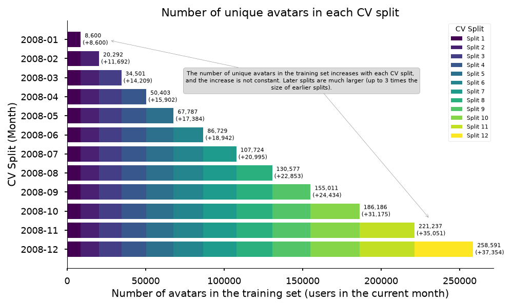

## Skrub {.smaller}

Machine learning on tabular data

{width="70%" style="margin-bottom: -1rem;"}

{width="60%" style="margin-bottom: -1rem;"}

::: {.incremental}
- [skrub-data.org](https://skrub-data.org)
- This talk: the [skrub DataOps](https://skrub-data.org/stable/data_ops.html) framework.
:::

## {.smaller}

:::: {.columns}

::: {.column width="44%"}

**Textbook ML**

<br>

$X \in \mathbb{R}^{n \times p},\ y \in \mathbb{R}^n$

$\hat{y} = f_{\hat{\theta}}(X)$

<br>

```{=html}
<pre><code class="language-python">estimator = <span style="outline: 3px transparent; outline-offset: 1px;">TabICLRegressor()</span>

cross_validate(estimator, X, y)

estimator.fit(X_train, y_train)
estimator.predict(X_new)</code></pre>
```
:::

::: {.column width="55%"}
**Data-Science Practice**


:::

::::

## {.smaller}

:::: {.columns}

::: {.column width="44%"}

**Textbook ML**

<br>

$X \in \mathbb{R}^{n \times p},\ y \in \mathbb{R}^n$

$\hat{y} = f_{\hat{\theta}}(X)$

<br>

```{=html}
<pre><code class="language-python">estimator = TabICLRegressor()

cross_validate(estimator, <span style="outline: 3px solid #2a52a8; outline-offset: 1px;">X</span>, <span style="outline: 3px solid #c04a10; outline-offset: 1px;">y</span>)

estimator.fit(X_train, y_train)
estimator.predict(X_new)</code></pre>
```
:::

::: {.column width="55%"}
**Data-Science Practice**


:::

::::

## {.smaller}

:::: {.columns}

::: {.column width="44%"}

**Textbook ML**

<br>

$X \in \mathbb{R}^{n \times p},\ y \in \mathbb{R}^n$

$\hat{y} = f_{\hat{\theta}}(X)$

<br>

```{=html}
<pre><code class="language-python">estimator = <span style="outline: 3px solid blue; outline-offset: 1px;">TabICLRegressor()</span>

cross_validate(estimator, X, y)

estimator.fit(X_train, y_train)
estimator.predict(X_new)</code></pre>
```
:::

::: {.column width="55%"}
**Data-Science Practice**


:::

::::

##

**Data wrangling:** filtering, resampling, aggregations, joins, ...

- Cross-validate without [**data leaks**]{style="color: #1a5a8a; font-weight: bold;"}.
- [**Tune choices**]{style="color: #1a5a8a; font-weight: bold;"} with validation scores.
- Replay on [**new inputs**]{style="color: #1a5a8a; font-weight: bold;"}.

::: {.callout-note icon=false style="font-size: 1em;"}
### DataOps

- All the goodies of the scikit-learn framework: `fit()` & `predict()`, cross-validation, hyperparameter tuning, serialization.
- Without the usual restrictions & while supporting **arbitrary data processing**.
  [Multiple inputs, feature & target construction, filtering samples, dynamic arguments for CV splitters & scorers, etc.]{style="font-size: 0.8em; color: gray;"}
- And more: Optuna integration, dynamic previews, pipeline inspection, ...
:::

## Basic example {.smaller}

Declare the pipeline

```python
data_path = skrub.var("data_path")
data = data_path.skb.apply_func(pd.read_csv)
X = data.drop(columns="target", errors="ignore").skb.mark_as_X()
y = data["target"].skb.mark_as_y()
pred = X.skb.apply(StandardScaler()).skb.apply(LogisticRegression(), y=y)
```

Cross-validate

```python
pred.skb.cross_validate({"data_path": "historical_data.csv"})
```

Make a "learner" (object with `fit()` & `predict()`)

```python
learner = pred.skb.make_learner().fit({"data_path": "historical_data.csv"})
learner.predict({"data_path": "new_data.csv"})
```

<a href="http://localhost:8888/notebooks/intro/intro.ipynb" target="_blank">intro.ipynb</a>

##


## The example: World of Warcraft Avatar History {.smaller}

- **Dataset**: WoWAH — ~11M timestamped "heartbeats" (one snapshot every ~10 min, 2006–2009, 91k avatars)
- **Task**: predict whether a player churns (no activity for two months) in month *M+1*
- **Unit of analysis**: the (character, month) pair, built as a cross-product grid
- **Features**: sessionization (`SessionEncoder`), monthly aggregates, zone-rarity / Gini location features, lag & diff features
- **Model**: `HistGradientBoostingClassifier` + `TableVectorizer`, month-by-month temporal CV 

Model optimization is _intentionally_ not the focus of this talk. 


## Pain point 1 — Leakage in temporal feature engineering {.smaller}

- Features must only use data available at scoring time
- Session detection and aggregations are **stateful w.r.t. time**: doing them once on the full table leaks the future
- sklearn `Pipeline` cannot do this: `X`/`y` must exist before the pipeline starts, and wrangling lives outside
- skrub docs warn explicitly: *aggregation can introduce data leakage* → wrap it in the DataOps plan
- In the example: `X` and `y` are cut **inside** the plan (`mark_as_X` / `mark_as_y`), so each CV fold re-runs the feature code on training data only

::: {.notes}
This is the central difficulty of the example (`main.py:90-186`). If the target month is April, features may only be built from February data and earlier (`main.py:136-143`). The skrub sessionization doc (`modules/multi_column_operations/sessionization.rst`) carries a warning box saying aggregation leaks unless it is re-fit per fold — either wrapped in an sklearn transformer or done "with the skrub Data Ops framework". DataOps bind the whole wrangling DAG to the prediction, so `skb.cross_validate()` re-executes the leakage-safe steps inside every fold automatically, instead of the user hand-rolling fold-by-fold feature construction.
:::

## Pain point 2 — Cross-validation with irregular time splits {.smaller auto-animate="true"}




## Pain point 2 — Cross-validation with irregular time splits {.smaller auto-animate="true"}


::: {.columns}

::: {.column}

- Off-the-shelf `TimeSeriesSplit` assumes folds of **equal size**
- Here the number of (character, month) rows **grows every month** — folds are unbalanced by nature

:::

::: {.column}


:::

:::

## Pain point 2 — Cross-validation with irregular time splits {.smaller auto-animate="true"}


::: {.columns}

::: {.column width=40%}


- Write a **custom splitter** that uses custom dataframe logic to select the samples
- With DataOps plug it in `skb.mark_as_X(cv=Splitter())`
- Now, the splitter is honored by `cross_validate`, `train_test_split`, randomized search, and scoring

:::

::: {.column width=60%}


```{.python code-line-numbers="|6-15"}
class Splitter:
    def split(self, user_month, has_played=None, interval="1mo"):
        time_range = pl.date_range(MIN_DATE, MAX_DATE, interval, eager=True)
        for split_point in time_range:
            test_month = pl.Series([split_point]).dt.offset_by(interval).first()
            train_idx = (
                user_month.with_row_index("idx")
                .filter(pl.col("month") <= split_point)["idx"]
                .to_list()
            )
            test_idx = (
                user_month.with_row_index("idx")
                .filter(pl.col("month") == test_month)["idx"]
                .to_list()
            )
            if train_idx and test_idx:
                yield train_idx, test_idx
```

:::

:::


## Pain point 3 — Tuning wrangling choices, not just model knobs {.smaller}

- Model choices are not limited to model hyperparameters: `session_gap` (15/30/60 min), include location features?, add Gini?, which lags?
- These are **data pipeline decisions**, with big performance and runtime impact
- **With DataOps** choices can be dropped inline, where the value is used — `choose_from`, `choose_bool`, `choose_float(log=True)`
- One call to `skb.make_randomized_search(backend="optuna", ...)` turns the whole DAG into a search 

## Pain point 3 — Tuning wrangling choices, not just model knobs {.smaller}
```{=html}
<ul style="font-size: 0.8em;">
<li>Replace any value with a choice:</li>
</ul>
<pre style="font-size: 0.55em; background-color: #f5f5f5; padding: 0.6em 1em; margin: 0.8em 0;"><code style="background-color: inherit;"> X = data.drop(columns="target", errors="ignore").skb.mark_as_X()
 y = data["target"].skb.mark_as_y()
 pred = X.skb.apply(StandardScaler()).skb.apply(
<span style="color: #c00; background-color: #fff0f0;">-    LogisticRegression(<span style="background-color: #f9a0a0;">C=1.0</span>),</span>
<span style="color: #080; background-color: #f0fff0;">+    LogisticRegression(<span style="background-color: #9be99b;">C=skrub.choose_float(0.1, 10.0, log=True)</span>),</span>
     y=y)</code></pre>
<ul style="font-size: 0.8em;">
<li>Use grid search or randomized search (possibly backed by Optuna).</li>
</ul>
<pre style="font-size: 0.55em; background-color: #f5f5f5; padding: 0.6em 1em; margin: 0.8em 0;"><code style="background-color: inherit;"><span style="color: #c00; background-color: #fff0f0;">-learner = pred.skb.<span style="background-color: #f9a0a0;">make_learner</span>().fit({...})</span>
<span style="color: #080; background-color: #f0fff0;">+learner = pred.skb.<span style="background-color: #9be99b;">make_randomized_search</span>().fit({...})</span></code></pre>
<ul style="font-size: 0.8em;">
<li>Tune data pipeline decisions, not only hyperparameters</li>
</ul>
<pre style="font-size: 0.55em; background-color: #f5f5f5; padding: 0.6em 1em; margin: 0.8em 0;"><code style="background-color: inherit;">X_enc = X.skb.apply_func(build_features,
<span style="color: #080; background-color: #f0fff0;">+  additional_features=<span style="background-color: #9be99b;">skrub.choose_bool()</span></span>
 )
 pred = X.skb.apply(LogisticRegression())</code></pre>
```

## Pain point 4 — One pipeline object, many inputs {.smaller}


::: {.columns}

::: {.column}

- Multi-input pipelines are usually scattered across scripts
- Input methods can differ between model setup and production (read from file, fetch an API...)
- The final DataOp behaves like one sklearn estimator: `.fit()`, save, load, `skb.eval(env)`, `skb.cross_validate(env)`
- Production: replay the *exact* trained DAG on new data, no need for glue code

:::

::: {.column}


```{.python code-line-numbers="|3-4,9-11|6-7,13-14"}
import skrub

def draft_loader():
  return pd.read_csv("path/to/file.csv")

def prod_loader():
  return api.fetch().to_pandas()

loader = skrub.var("loader", draft_loader, becomes_default=True)
# build the DAG  
learner = data_op.skb.make_learner(fitted=True)

# Use a different loader to get production data
learner.predict({"loader": prod_loader})

# No changes needed by the learner!

```

:::

:::

## Pain point 5 — Debugging a complex DAG

- Data Ops work **lazily**: they need to evaluate all nodes in the DAG to run
- Eager **previews**: pass a value to `var()` and every node shows its result immediately
- `skb.report()` emits an HTML report: every node's name, description, predecessors, fitted estimator, and **data preview**
- On failure, the report shows the offending node and the traceback

## Pain point 6 — Big data: subsampling and caching {.smaller}

- 11M rows → interactive development must be fast, but **sampling must preserve players' full trajectories** (`sample_by_user`, not random rows)
- Feature building (`build_feature_table`) is **very expensive** — naive re-runs during search would explode cost
- DataOps: `skb.subsample()` for development is **automatically off** for real `eval` / `cross_validate` runs
- Caching (`skrub.set_config(cache=True)`) persists expensive node results on disk **across trials** — changing only `learning_rate` doesn't recompute features
- In-memory reuse is free: the `feature_table` node is computed once per parameter set and shared (`main.py:229-239`)


## Pain point 7 — Stay in your dataframe API inside the plan {.smaller}

- Frameworks usually force you to leave Polars once you enter "pipeline land"
- DataOps are **transparent**: Polars methods are called directly on DataOps (`historical_data.with_columns(...)`, `.collect()`, indexing, joins)
- Python control flow (`for month in ...`) must be put in `@deferred` / `apply_func` functions
- Deferred functions appear as **one graph node** — good for reports and caching 
